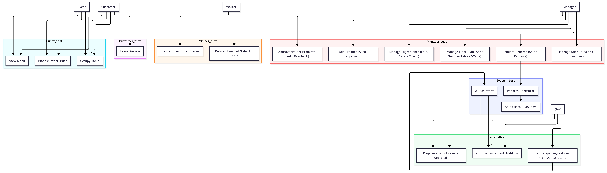
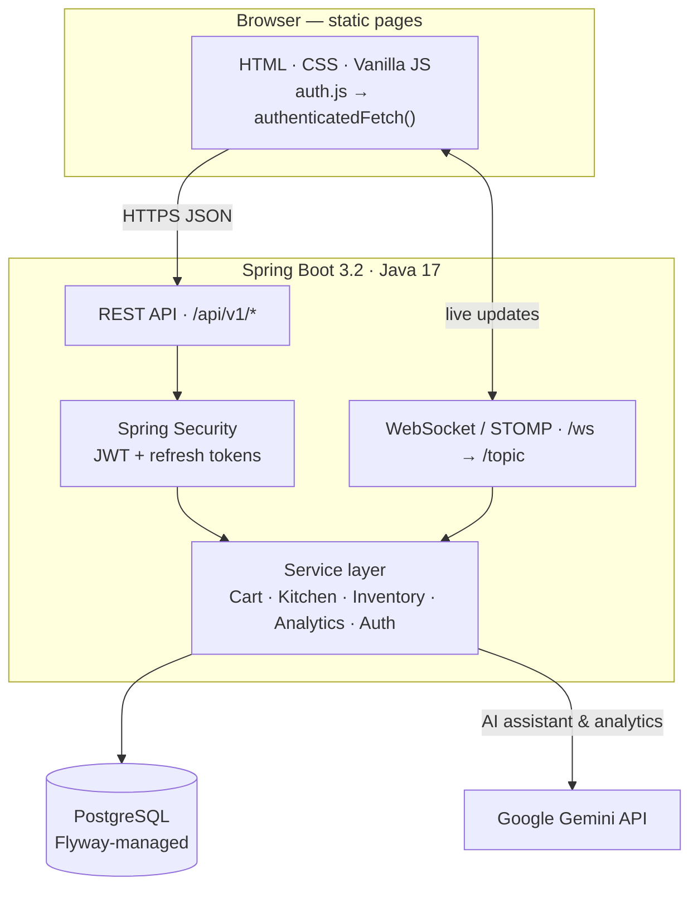
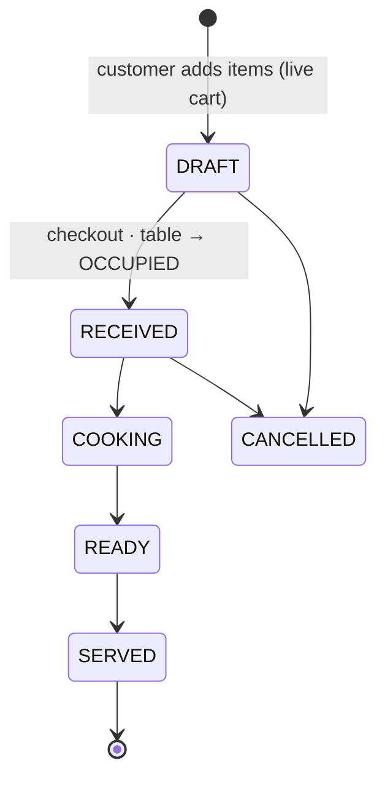
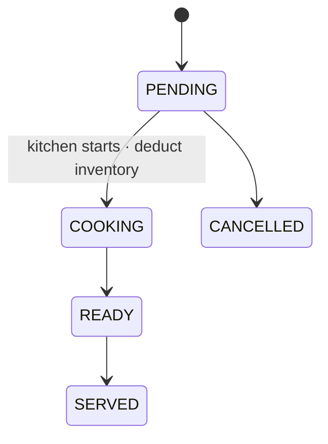
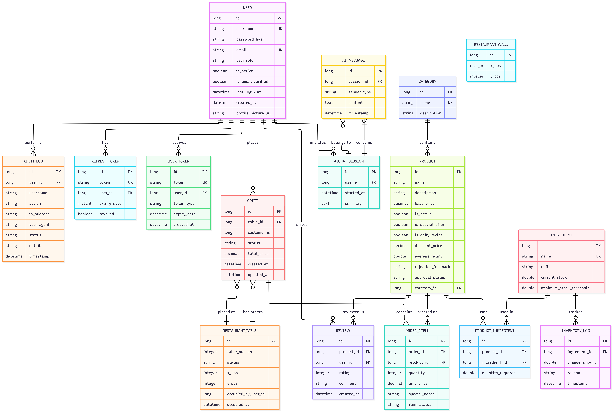
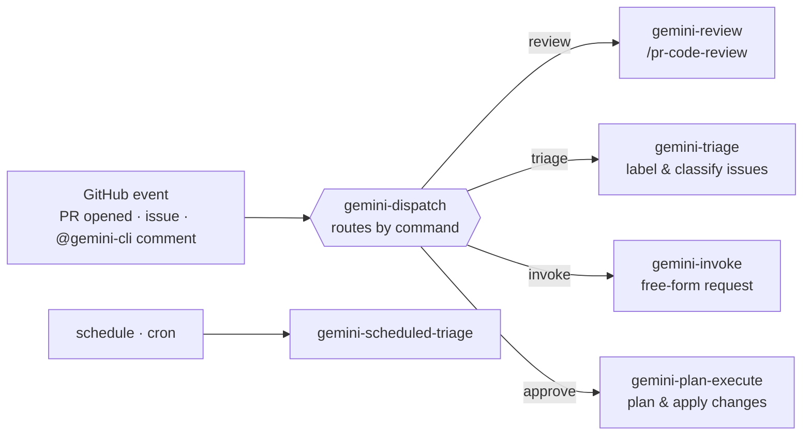

# 🍳 RamsAI Kitchen

**A real-time, AI-assisted restaurant management system** — from the customer's first tap on the digital menu to the manager's sales dashboard, all in one Spring Boot application.

<<<<<<< Updated upstream


---

## Overview

RamsAI Kitchen digitises the full service loop of a restaurant. Customers browse the
menu, pick a table on a live floor plan, and order from their phone. The kitchen sees
those orders stream in on a Kitchen Display System and pushes status updates back in
real time. Waiters manage the floor; managers approve menu changes, watch inventory
deduct itself per order, and read AI-generated sales analytics. A built-in Gemini
assistant helps the chef brainstorm recipes.

The backend is a single Spring Boot service that also serves the vanilla-JS frontend
from `src/main/resources/static/` — no separate frontend build is required to run it.

---

## Features

| Persona | What they can do |
| --- | --- |
| 🧑 **Customer** | Browse the live menu, pick a table, build a cart, place orders, track status in real time, leave reviews. |
| 🧑‍🍳 **Chef** | Kitchen Display System: see incoming orders, advance item status (`PENDING → COOKING → READY → SERVED`), propose new menu products, chat with the AI kitchen assistant. |
| 🤵 **Waiter** | Digital floor plan: see which tables are free/occupied, seat customers, manage table groups. |
| 👔 **Manager** | Dashboard with sales analytics, approve/reject chef-proposed products, toggle menu availability, manage users, ingredients & inventory, audit log. |

**Cross-cutting capabilities**

- ⚡ **Real-time updates** over WebSocket/STOMP (kitchen ↔ floor ↔ customer).
- 🔐 **Role-based security** with JWT access tokens + refresh-token rotation.
- 📦 **Automatic inventory deduction** when an item starts cooking, with a full inventory log.
- 🤖 **In-app AI** (Google Gemini) for the kitchen assistant and manager analytics.
- 🗄️ **Versioned schema** via Flyway migrations (seed data included for a ready-to-demo dataset).

### Use case diagram



---

## Tech stack

| Layer | Technology |
| --- | --- |
| Language / runtime | Java 17 |
| Framework | Spring Boot 3.2.5 (Web, Data JPA, Security, Validation, WebSocket, Mail) |
| Persistence | PostgreSQL 15 · Hibernate · Flyway migrations |
| Auth | Spring Security · JWT (`jjwt` 0.12) · refresh tokens |
| Mapping / boilerplate | MapStruct 1.5 · Lombok |
| Real-time | WebSocket + STOMP (`/ws` endpoint, `/topic` broker) |
| AI | Google Gemini API (`generativelanguage` REST) |
| Frontend | Vanilla HTML / CSS / JS served statically by Spring |
| Build & run | Maven · Docker / Docker Compose |
| CI / quality | GitHub Actions (CI, CodeQL) + Gemini review agents |

---

## Architecture



### Package layout (`com.ramsai.kitchen`)

```
controllers/     REST endpoints (Auth, Cart, Order, Kitchen, Table, Manager*, AIChat, ...)
services/        Business logic (CartService, KitchenService, InventoryService, ...)
repositories/    Spring Data JPA interfaces
models/
  entities/      JPA entities (Order, OrderItem, RestaurantTable, Product, User, ...)
  dtos/          Java records used as request/response bodies
mappers/         MapStruct interfaces
enums/           OrderStatus, ItemStatus, TableStatus, InventoryChangeReason, SenderType
config/          SecurityConfig, JwtAuthenticationFilter, WebSocketConfig, GeminiConfig, ...
exceptions/      GlobalExceptionHandler + custom exceptions
```

### API conventions

- Base path: `/api/v1/`
- Responses are wrapped: `{ "data": ..., "message": "..." }`
- DTOs are Java `record`s; entities are never exposed directly.
- The current user is injected via `@AuthenticationPrincipal User user`.

---

## Domain model & status flows

An **Order** belongs to a `RestaurantTable` and a customer. A `DRAFT` order *is* the
customer's live cart; checkout transitions it to `RECEIVED` and marks the table occupied.



Each **OrderItem** moves independently through the kitchen. Transitioning an item to
`COOKING` triggers automatic inventory deduction.



### Entity-relationship diagram



### Roles

`CUSTOMER` · `WAITER` · `CHEF` · `MANAGER` · `GUEST`. Endpoints are gated by role —
e.g. `MANAGER`-only admin operations, `CHEF | MANAGER` for the kitchen, and
`WAITER | MANAGER` for table management.

---

## Quick start
=======
## Demo Video

We have a demo! Check it out: https://youtu.be/_323vWkLjic

## Quick Start Tutorial
>>>>>>> Stashed changes

### Prerequisites

- [Docker](https://www.docker.com/) and Docker Compose.
- A Google **Gemini API key** (for the in-app AI features).

### 1. Configure environment

Create a `.env` file in the project root:

```dotenv
DATABASE_NAME=ramsai
DATABASE_USERNAME=ramsai
DATABASE_PASSWORD=change-me
PGADMIN_EMAIL=admin@ramsai.local
PGADMIN_PASSWORD=change-me
GEMINI_API_KEY=your-gemini-api-key
```

### 2. Run

```bash
docker compose up --build
```

| Service | URL |
| --- | --- |
| Application | http://localhost:8080 |
| pgAdmin (DB UI) | http://localhost:8888 |
| PostgreSQL | `localhost:5432` |

Flyway applies all migrations on first boot, including seed data — so you get a populated
menu, demo users, and sample sales history out of the box.

### Development with live reload

```bash
docker compose watch
```

- Edits under `src/main/resources/static` are **synced** into the container instantly.
- Edits under `src/` or to `pom.xml` trigger an automatic **rebuild & restart**.

### Running without Docker

With a PostgreSQL instance already running, set `DATABASE_URL`, `DATABASE_USERNAME`,
`DATABASE_PASSWORD`, and `GEMINI_API_KEY` in your environment, then:

```bash
mvn spring-boot:run
```

---

## Configuration

| Variable | Used by | Description |
| --- | --- | --- |
| `DATABASE_NAME` | Docker Compose | Postgres database name. |
| `DATABASE_USERNAME` | App + DB | Database user. |
| `DATABASE_PASSWORD` | App + DB | Database password. |
| `DATABASE_URL` | App (non-Docker) | Full JDBC URL, e.g. `jdbc:postgresql://localhost:5432/ramsai`. In Compose this is built for you. |
| `GEMINI_API_KEY` | App | Google Gemini API key for AI assistant & analytics. |
| `PGADMIN_EMAIL` / `PGADMIN_PASSWORD` | pgAdmin | Login for the bundled DB admin UI. |

The Gemini model and endpoint are configured in [`application.yml`](src/main/resources/application.yml).

---

## Database management

The Compose stack ships **pgAdmin** for browsing the database:

1. Open http://localhost:8888 and log in with `PGADMIN_EMAIL` / `PGADMIN_PASSWORD`.
2. Register a server pointing at host `db`, port `5432`, using your `DATABASE_*` credentials.

Schema changes are **never** made by hand — add a new Flyway migration under
[`src/main/resources/db/migration/`](src/main/resources/db/migration) named `V{N}__description.sql`.

---

## Project structure

```
RamsAI-Kitchen/
├── src/main/java/com/ramsai/kitchen/   # Spring Boot backend
├── src/main/resources/
│   ├── static/                         # Frontend: HTML/CSS/JS pages + auth.js
│   ├── db/migration/                   # Flyway migrations (V1…V21) + seed data
│   └── application.yml                 # App configuration
├── .github/
│   ├── workflows/                      # CI, CodeQL, and Gemini AI agents
│   └── commands/                       # Prompt definitions for the Gemini agents
├── docker-compose.yml                  # app + PostgreSQL + pgAdmin
├── Dockerfile
├── gemini.md                           # Gemini agent context
├── CLAUDE.md                           # Claude agent context
└── docs/                               # Product documentation
```

---

## 🤖 AI agents

RamsAI Kitchen uses AI in two distinct places.

### 1. In-app AI (Google Gemini)

- **Kitchen assistant** — a real-time chat (persisted as `AIChatSession` / `AIMessage`)
  that helps the chef brainstorm recipes from popular products.
- **Manager analytics** — AI-assisted summaries over sales data.

Wired up in [`GeminiConfig`](src/main/java/com/ramsai/kitchen/config/GeminiConfig.java),
[`AIChatService`](src/main/java/com/ramsai/kitchen/services/AIChatService.java), and
[`ManagerAnalyticsService`](src/main/java/com/ramsai/kitchen/services/ManagerAnalyticsService.java).

### 2. Repository automation agents (Gemini on GitHub Actions)

A dispatcher routes GitHub events (PR opened, new issue, or an `@gemini-cli` comment from a
maintainer) to the right specialised agent:



> ℹ️ The PR review runs on a Gemini **free-tier** key whose daily quota is shared across
> all PRs; it is intentionally **non-blocking**, so a quota/availability hiccup never gates a merge.

**Agent workflows & prompts**

| Agent | Workflow | Prompt |
| --- | --- | --- |
| Dispatch (router) | [`gemini-dispatch.yml`](.github/workflows/gemini-dispatch.yml) | — |
| PR code review | [`gemini-review.yml`](.github/workflows/gemini-review.yml) | [`gemini-review.toml`](.github/commands/gemini-review.toml) |
| Issue triage | [`gemini-triage.yml`](.github/workflows/gemini-triage.yml) | [`gemini-triage.toml`](.github/commands/gemini-triage.toml) |
| Scheduled triage | [`gemini-scheduled-triage.yml`](.github/workflows/gemini-scheduled-triage.yml) | [`gemini-scheduled-triage.toml`](.github/commands/gemini-scheduled-triage.toml) |
| Free-form invoke | [`gemini-invoke.yml`](.github/workflows/gemini-invoke.yml) | [`gemini-invoke.toml`](.github/commands/gemini-invoke.toml) |
| Plan & execute | [`gemini-plan-execute.yml`](.github/workflows/gemini-plan-execute.yml) | [`gemini-plan-execute.toml`](.github/commands/gemini-plan-execute.toml) |

**Agent context / instruction files**

- [`gemini.md`](gemini.md) — coding standards & architecture rules followed by the Gemini agents.
- [`CLAUDE.md`](CLAUDE.md) — project context for Claude-based agents.

---

## Documentation

- 📐 **Diagrams** — [use case](docs/use_case_diagram.png) · [entity-relationship](docs/entity_relation_diagram.png), plus the [Architecture](#architecture) and [status-flow](#domain-model--status-flows) diagrams above.
- 🤖 **AI agents** — see [AI agents](#-ai-agents) above.
- 📋 **Product requirements** — [`docs/user_stories.md`](docs/user_stories.md).
- ⚙️ **Agent configuration** — [`gemini.md`](gemini.md), [`CLAUDE.md`](CLAUDE.md).

---

<p align="center"><em>Built with Spring Boot, PostgreSQL, and a dash of Gemini. 🍽️</em></p>
